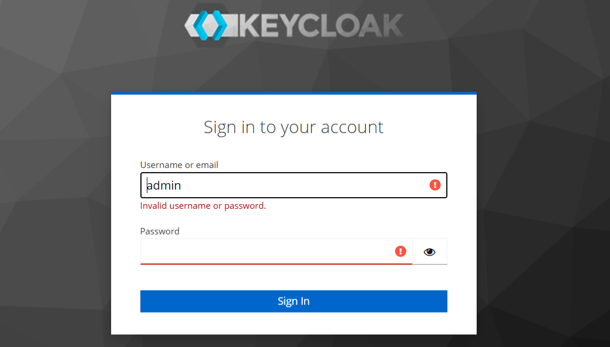
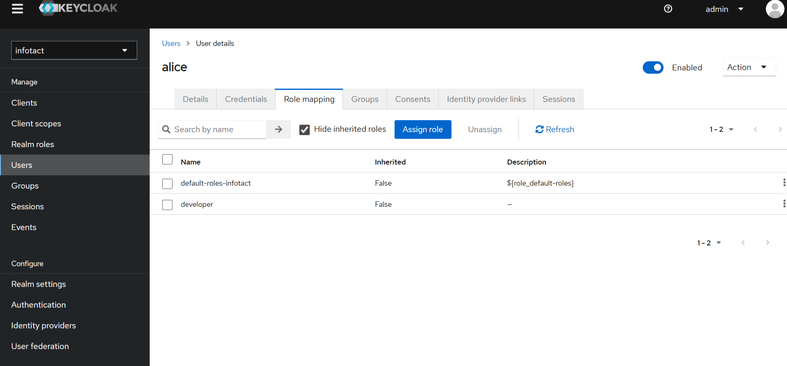
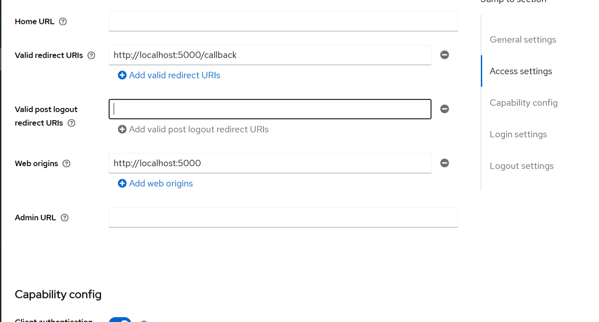

# Project 3 – IAM using Keycloak

## Overview
This project demonstrates Identity and Access Management (IAM) using Keycloak.
A Flask application is integrated to implement Single Sign-On (SSO) using
OpenID Connect (OIDC) and JWT tokens.

---

## Tech Stack
- Keycloak
- Docker
- Python (Flask)
- OpenID Connect (OIDC)
- JWT

---

## Implementation Proof

### Prerequisites
Docker and Python installation verified.

---

### Keycloak Running
Keycloak server running in Docker.

---

### Admin Login
Accessed Keycloak Admin Console.

---

### Realm Creation
Created custom realm named `infotact`.

---

### Roles Configuration
Created realm roles.

---

### User Creation
Created user `alice`.

---

### Role Mapping
Assigned `developer` role to user `alice`.

---

### Flask Application
Flask application running locally.

---

### Redirect to Keycloak
Application redirecting to Keycloak for authentication.

---

### JWT Token
Successful authentication returns JWT token.

---

## Outcome
- Implemented IAM using Keycloak
- Enabled SSO with OpenID Connect
- Verified role-based access using JWT

